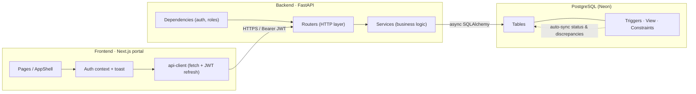
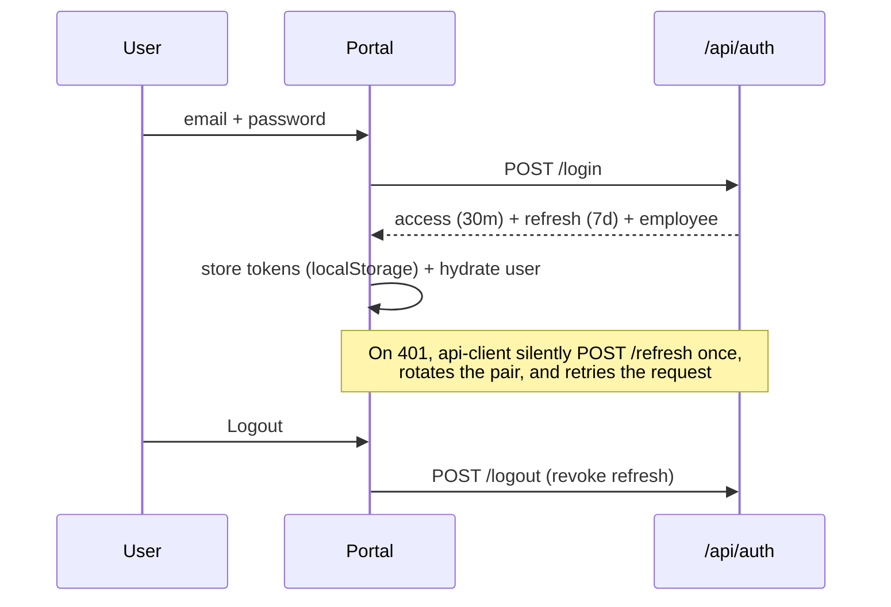
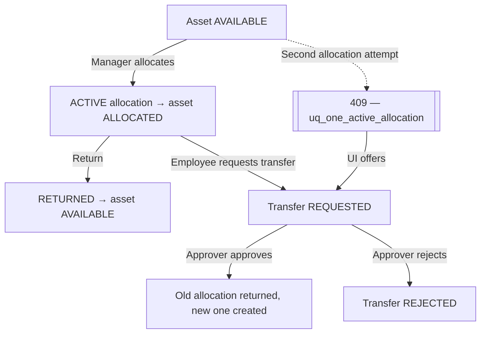
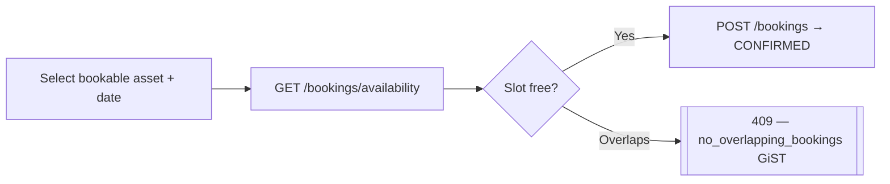
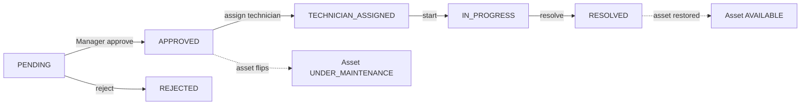
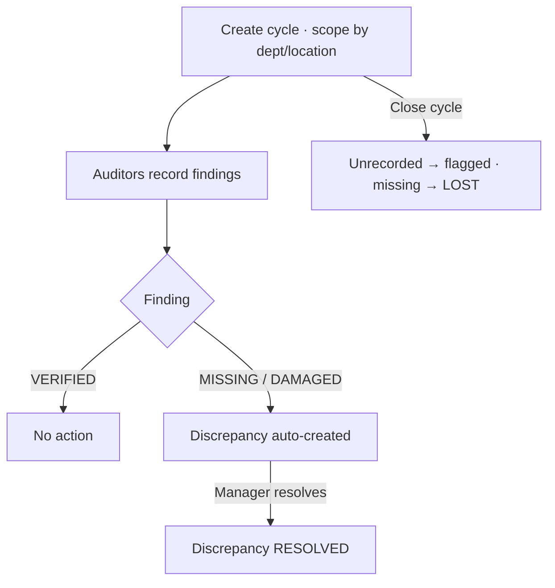
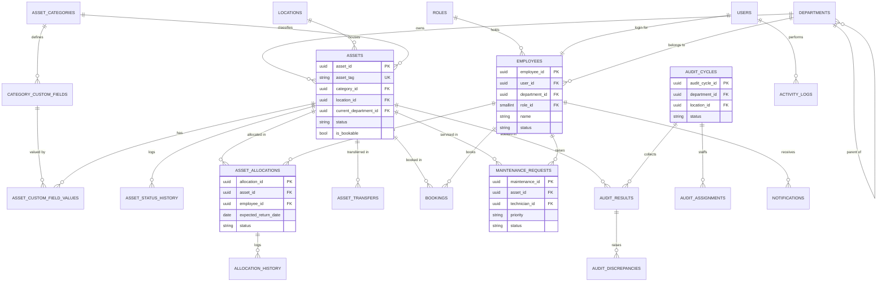

# AssetFlow

> Enterprise Asset & Resource Management — one system of record for asset lifecycles, allocations, resource bookings, maintenance approvals, and physical audit cycles.

AssetFlow replaces spreadsheets and paper logs with a role-aware platform where every asset movement, booking, repair, and audit finding is tracked, approved, and logged in real time.

**Stack**

| Layer | Technology |
|-------|-----------|
| Frontend | Next.js 14 (App Router) · React 18 · TypeScript · Tailwind CSS |
| Backend | FastAPI · SQLAlchemy 2.0 (async / asyncpg) · Pydantic v2 |
| Database | PostgreSQL (Neon) · Alembic migrations · 5 triggers, 1 view, GiST/partial constraints |
| Auth | JWT access + refresh (rotation) · bcrypt · role-based access control |

---

## Table of contents

- [System architecture](#system-architecture)
- [Feature flows](#feature-flows)
- [Entity-relationship diagram](#entity-relationship-diagram)
- [API reference](#api-reference)
- [Frontend guide](#frontend-guide)
- [Roles & access matrix](#roles--access-matrix)
- [Getting started](#getting-started)
- [Demo credentials](#demo-credentials)

---

## System architecture



**Layering:** `routers → services → database`. Routers own HTTP concerns (status codes, response models); services own logic and queries (no raw SQL in routers). Every write calls `log_activity(...)`; user-facing events call `create_notification(...)`.

**Database automation** — five PostgreSQL triggers keep state consistent without application glue:

| Trigger | Effect |
|---------|--------|
| `fn_sync_asset_status_on_allocation` | Asset → `ALLOCATED` on active allocation, back to `AVAILABLE` on return |
| `fn_sync_asset_status_on_maintenance` | Asset → `UNDER_MAINTENANCE` while a request is open |
| `fn_autogen_audit_discrepancy` | Auto-creates a discrepancy when an audit finding is `MISSING`/`DAMAGED` |
| `fn_close_audit_cycle` | On cycle close, unrecorded in-scope assets are flagged and lost ones marked `LOST` |
| `fn_backfill_booking_department` | Stamps the booker's department on new bookings |

Plus the `v_overdue_allocations` view, the `no_overlapping_bookings` GiST `EXCLUDE` constraint, and the `uq_one_active_allocation` partial index (one active allocation per asset).

---

## Feature flows

### Authentication & session



Signup always creates an **Employee**; roles are elevated later by an Admin in Organization Setup.

### Allocation & transfer



A duplicate-allocation attempt is rejected by the DB (`409`); the portal catches it and steers the user to **Request Transfer** instead.

### Resource booking



### Maintenance workflow



### Audit cycle



---

## Entity-relationship diagram



> The full physical schema (26 tables, all columns, constraints, triggers, view) lives in [`AssetFlow_Database_Schema.sql`](AssetFlow_Database_Schema.sql).

---

## API reference

Base URL: `http://localhost:8000/api` · Interactive docs: `http://localhost:8000/docs`

**Access legend** — `Public` (no auth) · `Auth` (any signed-in user) · `Mgr` (ADMIN, ASSET_MANAGER) · `Mgr+DH` (ADMIN, ASSET_MANAGER, DEPT_HEAD) · `Admin` (ADMIN only).

### Auth — `/api/auth`
| Method | Path | Access | Purpose |
|--------|------|--------|---------|
| POST | `/signup` | Public | Register (creates an Employee) |
| POST | `/login` | Public | Issue access + refresh tokens |
| POST | `/refresh` | Public | Rotate token pair |
| POST | `/logout` | Auth | Revoke refresh token |
| POST | `/forgot-password` | Public | Request reset token |
| POST | `/reset-password` | Public | Reset with token |

### Employees — `/api/employees`
| Method | Path | Access | Purpose |
|--------|------|--------|---------|
| GET | `` | Auth | List/filter employees |
| GET | `/{id}` | Auth | Employee detail |
| GET | `/{id}/role-history` | Auth | Role change history |
| PUT | `/{id}` | Self / Admin | Update profile |
| POST | `/{id}/promote` | Admin | Change role |
| DELETE | `/{id}` | Admin | Deactivate |

### Departments — `/api/departments`
| Method | Path | Access | Purpose |
|--------|------|--------|---------|
| GET | `` · `/{id}` · `/{id}/hierarchy` | Auth | List / detail / tree |
| POST · PUT · DELETE | `` · `/{id}` | Admin | Create / update / delete |

### Categories — `/api/categories`
| Method | Path | Access | Purpose |
|--------|------|--------|---------|
| GET | `` · `/{id}` · `/{id}/fields` | Auth | List / detail / custom fields |
| POST · PUT · DELETE | `` · `/{id}` | Admin | Manage categories |
| POST · PUT · DELETE | `/{id}/fields` · `/{id}/fields/{fid}` | Admin | Manage custom fields |

### Locations — `/api/locations`
| Method | Path | Access | Purpose |
|--------|------|--------|---------|
| GET | `` | Auth | List locations |
| POST · PUT · DELETE | `` · `/{id}` | Admin | Manage locations |

### Assets — `/api/assets`
| Method | Path | Access | Purpose |
|--------|------|--------|---------|
| GET | `` | Auth | Search/filter (q, status, category, dept, bookable, paginated) |
| GET | `/{id}` | Auth | Asset detail |
| POST | `` | Mgr | Register asset |
| PUT · DELETE | `/{id}` | Mgr | Update / delete |
| PATCH | `/{id}/status` | Mgr | Change lifecycle status |
| GET | `/{id}/history` | Auth | Combined allocation + maintenance history |
| GET · PUT | `/{id}/fields` | Auth / Mgr | Read / set custom field values |
| GET | `/{id}/attachments` | Auth | List attachments |

### Allocations — `/api/allocations`
| Method | Path | Access | Purpose |
|--------|------|--------|---------|
| GET | `` · `/{id}` | Auth | List / detail |
| GET | `/overdue` | Auth | Overdue allocations |
| POST | `` | Mgr+DH | Allocate asset |
| POST | `/{id}/return` | Mgr+DH | Process return |

### Transfers — `/api/transfers`
| Method | Path | Access | Purpose |
|--------|------|--------|---------|
| GET | `` · `/{id}` | Auth | List / detail |
| POST | `` | Auth | Request transfer |
| POST | `/{id}/approve` · `/{id}/reject` | Mgr+DH | Approve / reject |

### Bookings — `/api/bookings`
| Method | Path | Access | Purpose |
|--------|------|--------|---------|
| GET | `` · `/{id}` · `/{id}/history` | Auth | List / detail / history |
| GET | `/availability` | Auth | Free & booked slots for a date |
| POST | `` | Auth | Create booking (overlap → 409) |
| PUT | `/{id}/reschedule` | Auth | Reschedule |
| POST | `/{id}/cancel` | Auth | Cancel |

### Maintenance — `/api/maintenance`
| Method | Path | Access | Purpose |
|--------|------|--------|---------|
| GET | `` · `/{id}` · `/{id}/history` | Auth | List / detail / history |
| POST | `` | Auth | Raise request |
| POST | `/{id}/approve` · `/{id}/reject` · `/{id}/assign-technician` | Mgr | Route request |
| POST | `/{id}/start` · `/{id}/resolve` | Auth | Progress work |
| GET | `/{id}/attachments` | Auth | List attachments |

### Audits — `/api/audits` & `/api/discrepancies`
| Method | Path | Access | Purpose |
|--------|------|--------|---------|
| GET | `/audits` · `/audits/{id}` · `/audits/{id}/results` · `/audits/{id}/auditors` | Auth | Read cycles/results |
| POST | `/audits` | Mgr | Create cycle |
| POST | `/audits/{id}/close` | Mgr | Close cycle |
| POST · DELETE | `/audits/{id}/auditors` | Mgr | Manage auditors |
| GET | `/discrepancies` · `/discrepancies/{id}` | Auth | List / detail |
| POST | `/discrepancies/{id}/resolve` | Mgr | Resolve |

### Dashboard, Reports, Notifications, Logs, Roles
| Method | Path | Access | Purpose |
|--------|------|--------|---------|
| GET | `/dashboard/kpis` | Auth | Role-scoped KPIs + upcoming returns |
| GET | `/reports/utilization` · `/maintenance-frequency` · `/department-summary` · `/booking-heatmap` · `/retirement-forecast` | Mgr | Analytics |
| GET | `/reports/export?type=&format=` | Mgr | xlsx/pdf download |
| GET · POST | `/notifications` · `/notifications/read-all` · `/notifications/{id}/read` | Auth | Own notifications |
| GET | `/logs` · `/logs/{table}/{id}` | Mgr | Activity audit trail |
| GET | `/roles` | Auth | List roles |

> Full request/response shapes, error codes, and trigger effects: [`docs/API_AND_DATA_FLOW.md`](docs/API_AND_DATA_FLOW.md).

---

## Frontend guide

The portal is a Next.js 14 App Router application in [`portal/`](portal/).

### Structure

```
portal/src/
├── app/
│   ├── layout.tsx           # imports globals.css + app.css, wraps <Providers>
│   ├── providers.tsx        # ToastProvider + AuthProvider
│   ├── login / signup       # public auth screens
│   ├── dashboard            # role-scoped KPIs (auto-refresh)
│   ├── setup                # Organization Setup (depts / categories / employees)
│   ├── assets, allocations, bookings, maintenance, audits, reports, activity
│   ├── globals.css          # design tokens + landing styles
│   └── app.css              # in-app design system (shell, panels, tables, modals)
├── components/AppShell.tsx  # sidebar + topbar, auth guard, role-based nav, logout
└── lib/
    ├── api-client.ts        # fetch wrapper: Bearer injection, 401→refresh→retry
    ├── auth-store.ts        # token storage + JWT claim decode
    ├── auth-context.tsx     # AuthProvider / useAuth (login, signup, logout, hasRole)
    ├── toast.tsx            # useToast (success / error / info)
    ├── use-api.ts           # data-fetch hook (loading / error / refetch)
    ├── use-debounced.ts     # debounced value (search inputs)
    └── api/                 # typed modules per domain (assets, allocations, …)
```

### Data-access pattern

- **`api-client.ts`** — single fetch wrapper. Reads `NEXT_PUBLIC_API_BASE_URL`, injects `Authorization: Bearer`, and on a `401` transparently calls `/auth/refresh` once (shared in-flight promise), rotates tokens, and retries. Normalizes every error to `ApiError { message, status, detail }`.
- **`lib/api/*.ts`** — one typed module per domain exposing methods (`assetsApi.list(...)`, `bookingsApi.availability(...)`) plus shared label/color maps for statuses.
- **`use-api.ts`** — every page fetches through `useApi(fetcher, deps)`, which returns `{ data, loading, error, refetch }` and aborts stale requests.

```ts
const { data, loading, error, refetch } = useApi(
  (signal) => assetsApi.list({ q, status, page }, signal),
  [q, status, page],
);
```

### Auth & role-based UI

`AuthProvider` hydrates the user from a cached profile or the JWT claims, exposes `login / signup / logout / hasRole`, and `AppShell` enforces the guard: unauthenticated users are redirected to `/login`, and the sidebar only renders nav items the current role may use (`Organization Setup` → Admin, `Audits`/`Reports` → managers, etc.).

### Environment

Create `portal/.env.local`:

```
NEXT_PUBLIC_API_BASE_URL=http://localhost:8000/api
```

---

## Roles & access matrix

| Capability | Employee | Dept Head | Asset Manager | Admin |
|------------|:--------:|:---------:|:-------------:|:-----:|
| View assets / bookings / own data | ✅ | ✅ | ✅ | ✅ |
| Book resources · request transfers · raise maintenance | ✅ | ✅ | ✅ | ✅ |
| Allocate / return assets · approve transfers | — | ✅ | ✅ | ✅ |
| Register assets · change status · approve maintenance | — | — | ✅ | ✅ |
| Run audits · resolve discrepancies · reports & logs | — | — | ✅ | ✅ |
| Organization setup · promote roles | — | — | — | ✅ |

---

## Getting started

### Backend

```bash
cd backend
python -m venv .venv
.venv/Scripts/python.exe -m pip install -r requirements.txt      # Windows
# copy .env.example → .env and set DATABASE_URL + JWT_SECRET_KEY
.venv/Scripts/python.exe -m alembic upgrade head
.venv/Scripts/python.exe -m scripts.seed_data                     # rich demo data
.venv/Scripts/python.exe -m uvicorn app.main:app --reload
```

API at `http://localhost:8000` · docs at `/docs`. Full commands: [`docs/SETUP.md`](docs/SETUP.md).

### Frontend

```bash
cd portal
npm install
# create .env.local with NEXT_PUBLIC_API_BASE_URL
npm run dev
```

Portal at `http://localhost:3000`.

---

## Demo credentials

After running `scripts.seed_data`:

| Role | Email | Password |
|------|-------|----------|
| ADMIN | `admin@assetflow.com` | `Admin@123` |
| ASSET_MANAGER | `asset.mgr1@assetflow.com` | `AssetMgr@123` |
| DEPT_HEAD | `head.tech@assetflow.com` | `Head@123` |
| EMPLOYEE | `priya.nair@assetflow.com` | `Employee@123` |
